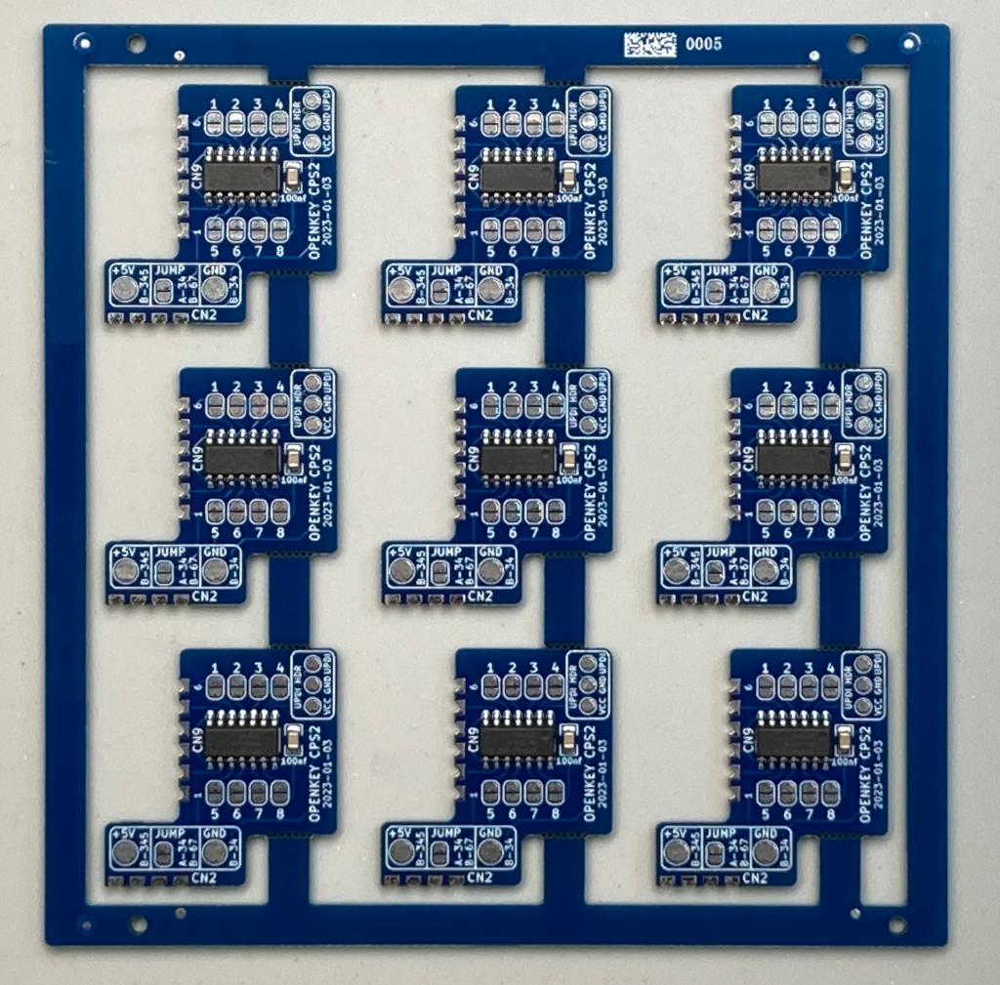
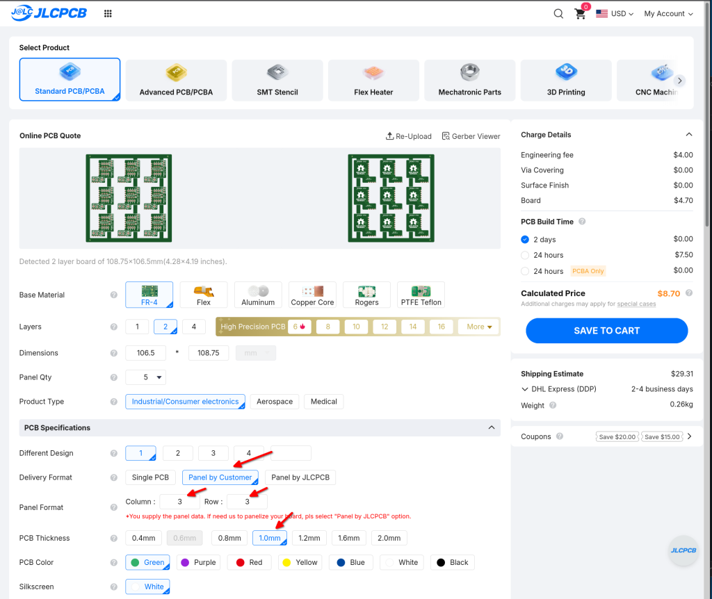
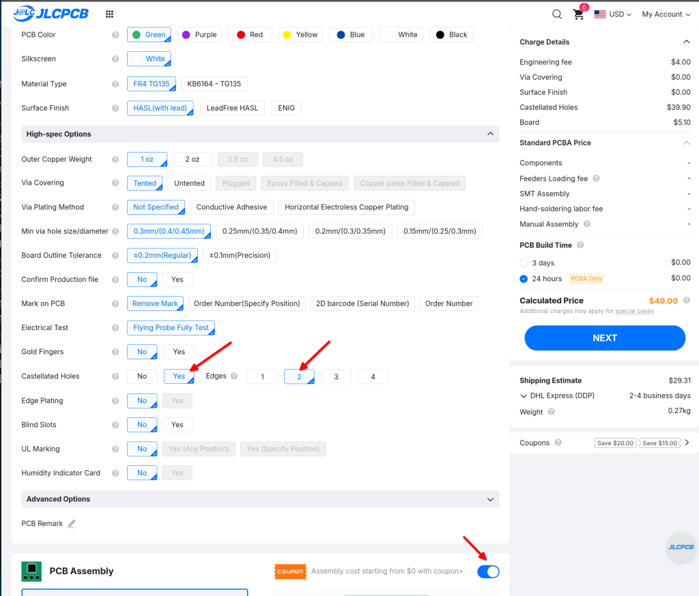
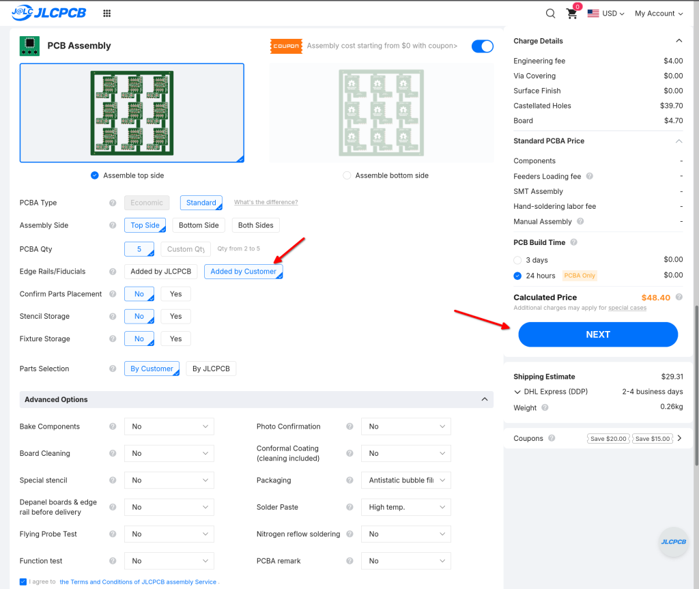
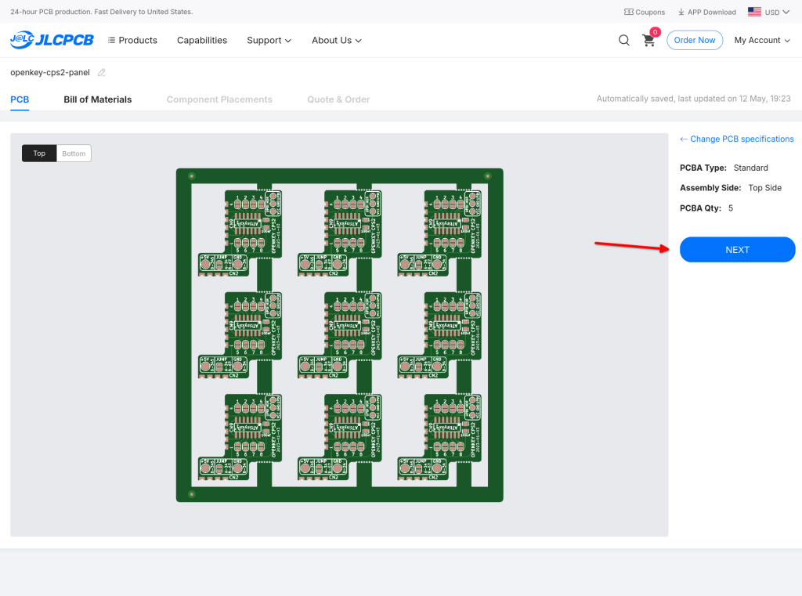
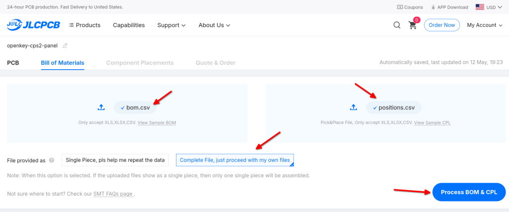
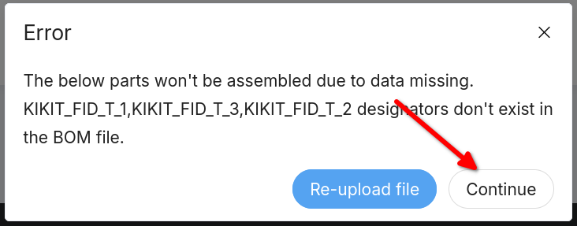
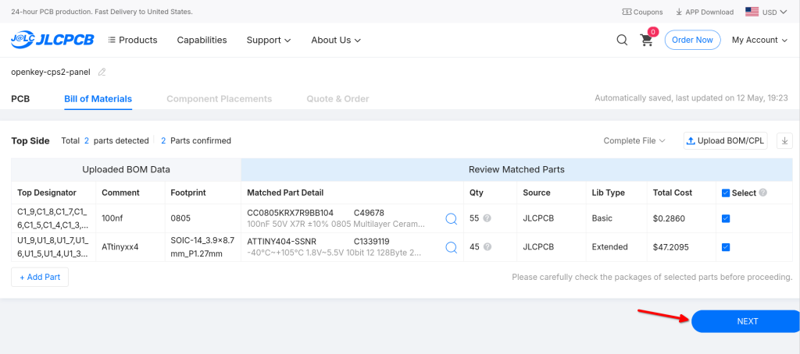
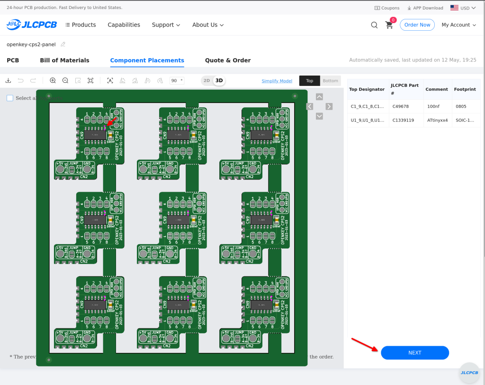
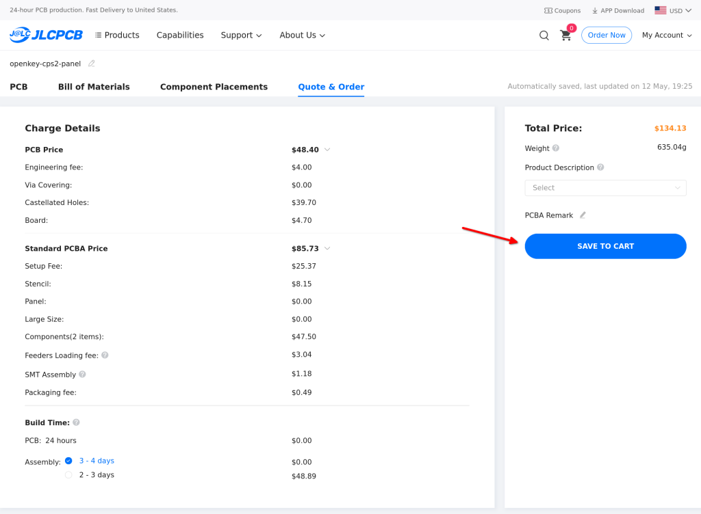

# Panel Details
The panel version of openkey-cps2 contains 9 boards and is setup to allow
the board manufacture to assemble them.  I've only had jlcpcb do the assembly,
the below instructions may or may not work with other pcb manufactures.



**IMPORTANT:** Make sure you are logged into your jlcpcb account before trying
to upload the panel to their instant quote page.  They often seem to stop
processing uploaded gerber files and give up if you aren't logged in.

Goto https://github.com/jwestfall69/openkey-cps2/releases/tag/hw-rev-2023-01-03
and grab `openkey-cps2-panel-hw-rev-2023-01-03-updated.zip`

If you are only wanting the PCBs, upload openkey-cps2-panel.zip (gerbers)
file that is within the downloaded panel release zip file to jlcpcb's quote
page.  Then continue on.

**IMPORTANT:** This will get you the assembled boards, but you must still
program them (and hopefully test them).

### Quote Page
This is the normal quote page for jlcpcb.  Upload openkey-cps2-panel.zip
(gerbers) file that is within the downloaded panel release zip, then set the
following settings as seen in the pictures below


* Set Delivery Format to `Panel by Customer`
* Set Panel Format to Column: 3 and Row: 3
* Set PCB Thickness to 1.0mm (or leave at the default of 1.6mm if you prefer)
* Pick whatever color you want


* Set Castellated Holes to YES with 2 sides
* Enable PCB Assembly


* Set Edge Rails/Fiducials to `Added by Customer`
* Click NEXT

### PCB
The next page just shows an image of the PCB, click NEXT again


### BOM + Position Files

* Upload bom.csv from the panel release zip
* Upload positions.csv from the panel release zip
* Set File provided as to `Complete File, just proceed with my own files`
* Click Process BOM & CPL

Expect to get the following error when clicking, just click continue.  Kikit is
used to generate the panel PCB from the single board PCB.  Its fiducials are
getting auto added to the positions.csv file by the jlcpcb fabrication exports plugin.


### Parts

This page is showing the parts needed for assembly.  The jlcpcb's LCSC part
numbers are provide in the bom.csv, so they should be able to figure out the
parts from their inventory.  Its just 9x 100uf and 9x ATtiny404s per panel.

Its not clear to me why they over quantity the 100uf, but they are super cheap.
In the above picture its $0.28 for 55 of them.

NOTE: when I placed my test order there were only 270 ATtiny404s in stock.  I'm
not sure what jlcpcb does if there isn't enough inventory.

### Parts Placement
The next screen will show you where jlcpcb thinks the components should be
placed on the panel. 



Make sure the parts are in the proper locations and that pin 1 (pinkish dots)
for each board in the panel is in the upper right as pointed out by the red
arrow.  If that looks good click NEXT

### Save to Cart
The last page goes over the cost totals, if those look good click save to cart
and then checkout.


## Generating A new panel
Notes if you want to generate a new panel from the original pcb.  You will need
to install [kikit](https://github.com/yaqwsx/KiKit) and the associated kikit
plugin/library in kicad (Tools->Plugin And Content Manger) then Plugins->kikit
and Libraries->kikit.

From the command line goto to hardware directory of the openkey-cps2 project and
create a new directory like `panel-test`.  Then running the following command to
generate the panel version.

```
jwestfall@bazzite:~/openkey-cps2/hardware$ kikit panelize -p kikit-openkey-cps2-panel.json openkey-cps2.kicad_pcb panel-test/openkey-cps2-panel.kicad_pcb
```
